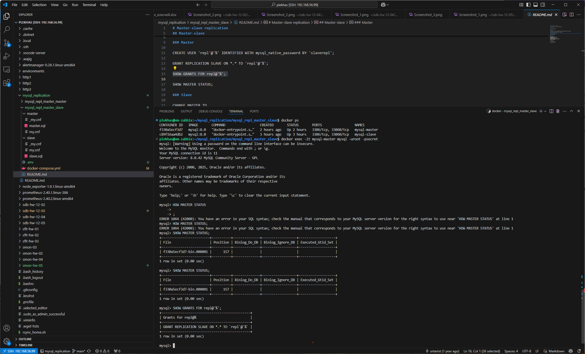
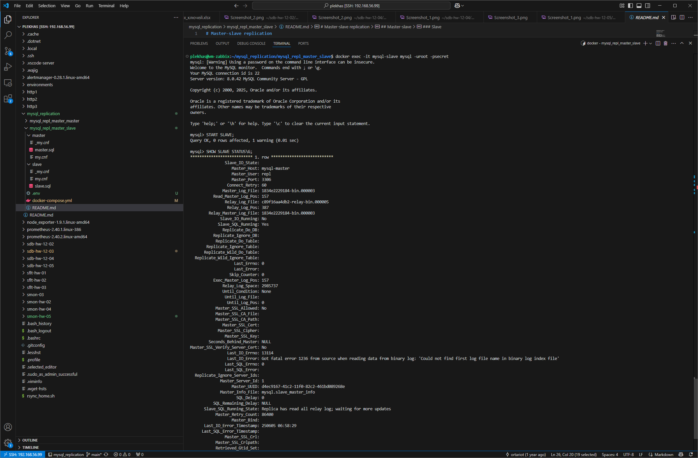

# Домашнее задание к занятию «Репликация и масштабирование. Часть 1» - Плеханов С.А.

### Задание 1

На лекции рассматривались режимы репликации master-slave, master-master, опишите их различия.

*Ответить в свободной форме.*

### Решение 1

Репликация master-slave предполагает изменения в базе данных только на уровне хоста master,  на slave устанавливается рехжим "только чтение".

### Задание 2

Выполните конфигурацию master-slave репликации, примером можно пользоваться из лекции.

*Приложите скриншоты конфигурации, выполнения работы: состояния и режимы работы серверов.*

### Решение 2

